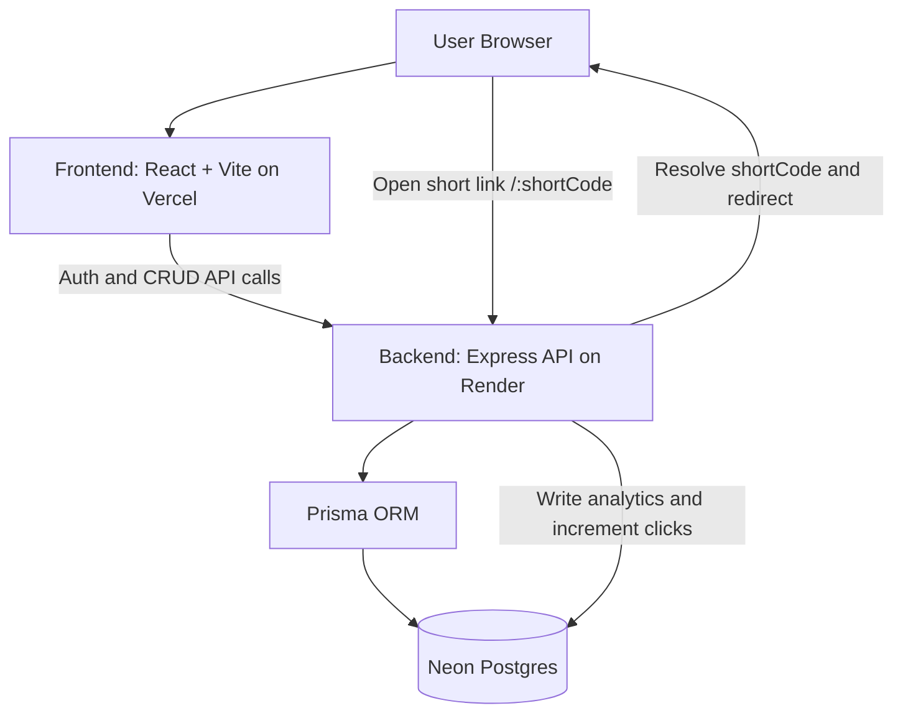

# URL Shortener with Analytics

Full stack URL shortening app with user authentication, short-code redirects, and basic click analytics.

## AI App Building Workflow (from idea to deployed app)

### 1. Planning the app
1. Define the problem:
   - Users need a simple way to shorten long URLs.
   - Short links must redirect to the original URL.
   - The system should record usage (click analytics).
2. Define key user journeys:
   - Register -> login -> create a short URL.
   - Click a short URL -> redirect -> record analytics.
   - View dashboard -> see created links + click counts.
   - View analytics page -> see recent visits / chart data.
3. Choose architecture and boundaries:
   - Frontend: React + Vite.
   - Backend: Express API with JWT auth.
   - Database: Neon Postgres + Prisma ORM.
4. Specify data and API responsibilities:
   - Backend owns:
     - Authentication (register/login).
     - URL creation and validation.
     - Redirect handling + analytics writes.
5. Deployment targets:
   - Frontend on Vercel.
   - Backend on Render.
   - Database on Neon.

### 2. Features (what the app performs)
Authentication
- User registration (`POST /api/auth/register`)
- User login (`POST /api/auth/login`)
- JWT-based protected API routes (URLs and analytics require Authorization header)

URL shortening
- Create a short URL (`POST /api/urls`)
- Optional custom alias
- Optional expiration date (`expiresAt`)
- Validation of `longUrl` (basic URL parsing)
- Return a `shortUrl` for each created URL

Redirection + analytics
- Redirect endpoint:
  - `GET /:shortCode` (handled by the backend Express app)
- Resolve short code to a long URL:
  - 404 if short code does not exist
  - 410 if the URL is expired
  - Redirect to long URL if active
- Record analytics on each redirect:
  - `Analytics` row created with `ipAddress`, `userAgent`, and derived `deviceType`
  - Increment URL `clickCount`

Frontend pages
- Login page
- Register page
- Dashboard:
  - Create URL form
  - List user URLs (copy short URL, view stats, delete)
- Analytics page:
  - Chart of clicks (implementation depends on backend analytics response)
  - Recent visits list

### 3. Assumptions made
- Users will provide valid `longUrl` values (backend still validates, but UI expects correct formatting).
- JWT secret and database URL will be configured correctly in Render environment variables.
- Database migrations are applied to the Neon DB at deploy time.
- “Short URL” should be served from the backend (Render) because the redirect handler is implemented there (`GET /:shortCode`).

### 4. Implementation architecture
The application is split into:
- `client/`:
  - React UI
  - Calls backend via Axios using `VITE_API_URL`
- `server/`:
  - Express routes for auth, URLs, analytics
  - Prisma models: `User`, `Url`, `Analytics`
  - Redirect endpoint `GET /:shortCode`

## Architecture Diagram



## Repository Layout
- `client/`: React + Vite frontend
- `server/`: Express backend + Prisma + redirect handler

## Setup Instructions (Local Development)

### Prerequisites
- Node.js (npm)
- Neon Postgres database
- A JWT secret string

### 1. Server setup
1. Go to `server/`:
   - Install dependencies:
     - `npm install`
2. Configure environment variables:
   - Edit `server/.env` and set:
     - `DATABASE_URL=...` (Neon connection string)
     - `JWT_SECRET=...`
     - `PORT=5000` (or your preferred port)
3. Apply database migrations:
   - `npx prisma migrate deploy`
   - (If this is your first setup locally, you can use `npx prisma migrate dev` instead.)
4. Start the server:
   - `npm run dev`

### 2. Client setup
1. Go to `client/`:
   - Install dependencies:
     - `npm install`
2. Configure environment variables:
   - Edit `client/.env` and set:
     - `VITE_API_URL=http://localhost:5000/api`
3. Start the client:
   - `npm run dev`

### 3. End-to-end test
1. Register a new user.
2. Login.
3. Create a short URL.
4. Click the generated `shortUrl` and confirm:
   - It redirects to `longUrl`.
   - Click analytics are stored in the database.

## Deployment Notes (Vercel + Render + Neon)

### Frontend (Vercel)
- Build and deploy `client/`.
- Set `VITE_API_URL` to your Render backend base, including `/api`.
  - Example: `https://<render-host>/api`

### Backend (Render)
- Build and deploy `server/`.
- Environment variables required:
  - `DATABASE_URL` (Neon)
  - `JWT_SECRET`
  - `PORT` (optional, defaults to `5000`)
  - `BASE_URL` (optional; used as fallback for redirect URL generation)
- Start command:
  - `npm start`
- Migrations:
  - This repo is configured to run migrations automatically on `npm start` via `prestart`.
  - That ensures Neon tables exist before the app serves requests.

## AI Planning Document (Readable Checkpoint)

### Goals
- Make URL shortening usable in a few steps (register/login/create/click).
- Ensure redirects work in production with correct base URLs.
- Persist analytics consistently using Prisma models.

### Risks and mitigations
- Risk: DB schema missing tables in production -> 500 errors.
  - Mitigation: Run `prisma migrate deploy` during server startup.
- Risk: Short links point to the wrong domain/route.
  - Mitigation: Ensure `shortUrl` targets the backend origin because redirect handler lives in the backend (`GET /:shortCode`).

### Test checklist
- Register works (returns token + user).
- Login works (returns token).
- Create URL works (returns `shortUrl`).
- Clicking short URL redirects and increments click count.
- Analytics page displays recent visits and chart data.

## Video / Demo Link (Required)
Recorded demo video:
- Loom/YouTube URL: [URL Shortener Demo Video](https://drive.google.com/file/d/1aTRN6AeCSqfHhMcra6dQ8ENbh2_inKPR/view?usp=sharing)

### Video Demo Structure (suggested)
1. Show registration/login flow.
2. Create a short URL (with and without custom alias).
3. Click short link and show redirect.
4. Show analytics: click count + recent visits.

## Sample Output (from your video)
This section should include evidence of working execution:

### Sample server logs
Example logs (replace timestamps/values as needed):
```text
prisma: Starting migration deploy...
prisma: Applied migration(s) successfully.
Server running on port 5000
```

### Sample redirect behavior
Example: clicking `https://<render-host>/<shortCode>` results in a 302 redirect to the original `longUrl`.

### Sample DB entries (illustrative)
1. `User` row:
```json
{
  "id": "8a0e2d5a-1111-2222-3333-aaaaaaaaaaaa",
  "name": "Test User",
  "email": "test@example.com",
  "passwordHash": "********",
  "createdAt": "2026-03-23T12:34:56.789Z"
}
```
2. `Url` row:
```json
{
  "id": "b1c2d3e4-1111-2222-3333-bbbbbbbbbbbb",
  "userId": "8a0e2d5a-1111-2222-3333-aaaaaaaaaaaa",
  "longUrl": "https://example.com/some/long/path",
  "shortCode": "k9LxQp",
  "customAlias": null,
  "clickCount": 1,
  "expiresAt": null,
  "isActive": true
}
```
3. `Analytics` row (created on redirect):
```json
{
  "id": "c3d4e5f6-1111-2222-3333-cccccccccccc",
  "urlId": "b1c2d3e4-1111-2222-3333-bbbbbbbbbbbb",
  "visitedAt": "2026-03-23T12:35:10.001Z",
  "ipAddress": "203.0.113.10",
  "userAgent": "Mozilla/5.0 (...)",
  "deviceType": "desktop",
  "country": null
}
```

### Screenshots
Below are the screenshots captured from the working application flow:


---
This project is a part of a hackathon run by https://katomaran.com
